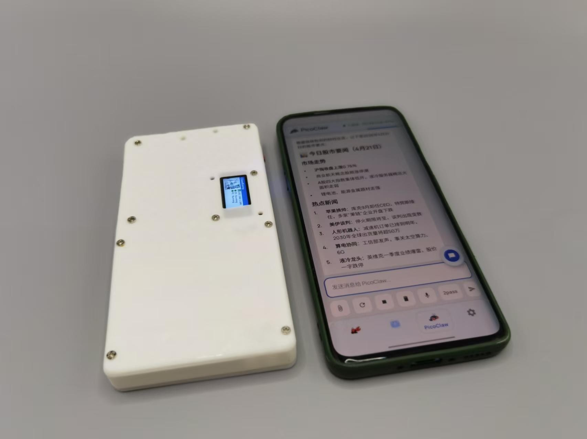

# ClawBoard

ClawBoard is a simple configuration and service manager for a **Clawberry Host** — a small local machine (Raspberry Pi Zero 2W, Radxa Cubie A7Z/A7A, or any localhost) that runs one or more Claw agents: [ZeroClaw](https://github.com/zeroclaw-labs/zeroclaw), [PicoClaw](https://github.com/zeroclaw-labs/picoclaw), or [OpenClaw](https://github.com/zeroclaw-labs/openclaw).

The client app is [ClawBerry](https://github.com/zphilip/clawBerry).

## Hardware

| Raspberry Pi Zero2W/ Radxa Cubie A7Z / A7A |
|-----------------------|
|  |

## Screenshots

| Dashboard | ZeroClaw | PicoClaw |
|-----------|----------|----------|
|  |  |  |

| WIFI Settings | Upgrade |
|---------------|---------|
|  |  |

## What it does

1. **Web configuration UI** — a NiceGUI-based dashboard to configure the running ZeroClaw (`config.toml`), PicoClaw(`config.json`), or OpenClaw agent (`openclaw.json`) from any browser or phone.

2. **System services** — systemd service templates for running everything on the host:
   - **WiFi Connect** — captive-portal based WiFi setup
   - **Service Publish** — mDNS/network broadcast so the ClawBerry app can discover the host
   - **Claw agent services** — ZeroClaw, PicoClaw, OpenClaw
   - **Upgrade service** — online over-the-air upgrade
   - **Proxy service** — ClawBerry proxy (see below)

3. **ClawBerry Proxy** — a WebSocket proxy that lets the [ClawBerry](https://github.com/zphilip/clawBerry) client app connect to a single endpoint and reach whichever Claw backend(s) are running. No per-device API pairing or token management needed — all backends register to the proxy and the client talks to the proxy.

   ```
   ClawBerry app
       │
       ▼
   clawproxy :18780
       ├──► ZeroClaw  :42617/ws/chat
       ├──► PicoClaw  :18790/ws
       └──► OpenClaw  (configured port)
   ```

4. **Upgrade script** — pull the latest release and restart services in one step.

> Security is intentionally minimal — this is a local-only host, not exposed to the internet.

Note: the user creation steps is still missed in the sync script.. I do it in image genereation.. so it might have some problem on the script run, I use zeroclaw/picoclaw/openclaw user for each service。 It will be added later release.

## Setup

The easiest way to install or upgrade everything on the host is the sync script — it fetches the latest release, deploys binaries, installs systemd services, and restarts affected services automatically:

```bash
sudo bash /usr/local/bin/clawberry-workspace-sync.sh
```

On first install (before the script is on the device), bootstrap it from the repo:

```bash
curl -fsSL https://raw.githubusercontent.com/zphilip/ClawBoard/main/scripts/clawberry-workspace-sync.sh \
  | sudo bash
```

After sync, the dashboard is available at `http://<host>:8080`.

### Sync options

```bash
# Also reset config files from repo defaults
sudo clawberry-workspace-sync.sh -config all

# Reset without configuration files
sudo clawberry-workspace-sync.sh 
```
Notes: those claw agent is installed at /var/lib/xxxclaw, so if you install in different place , you need modify those in the daemon service files and related scripts

### Services installed

| Service | Description |
|---------|-------------|
| `clawboard` | Web configuration dashboard (port 8080) |
| `clawberry-proxy` | WebSocket proxy for ClawBerry app (port 18780) |
| `zeroclaw` | ZeroClaw agent |
| `picoclaw` | PicoClaw agent |
| `picoclaw-web` | PicoClaw web launcher |
| `clawberry-wifi-connect` | Captive-portal WiFi setup |
| `clawberry-publish` | mDNS service broadcast |

## Related

- [ClawBerry](https://github.com/zphilip/clawBerry) — mobile client app
- [ZeroClaw](https://github.com/zeroclaw-labs/zeroclaw) — AI agent (Raspberry Pi / localhost)
- [PicoClaw](https://github.com/zeroclaw-labs/picoclaw) — lightweight agent gateway
- [OpenClaw](https://github.com/zeroclaw-labs/openclaw) — agent for Radxa / more capable hardware
- [NiceGUI](https://nicegui.io) — Python web UI framework

## License

Copyright © 2025-2026 ClawBoard Contributors — [GPL-3.0](https://www.gnu.org/licenses/gpl-3.0.html)
