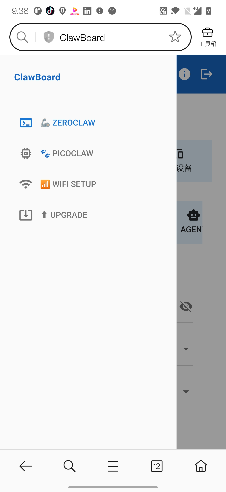
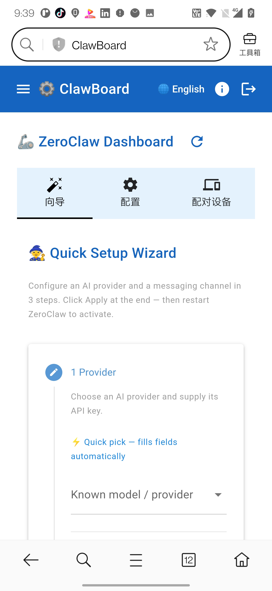
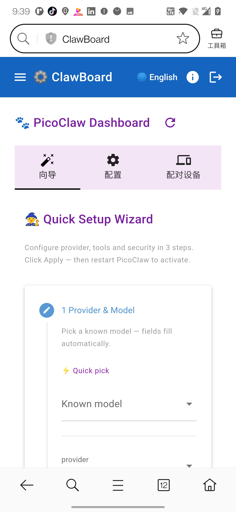
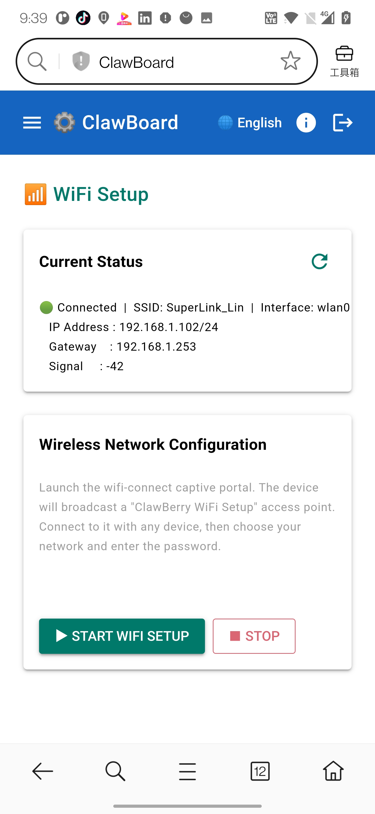
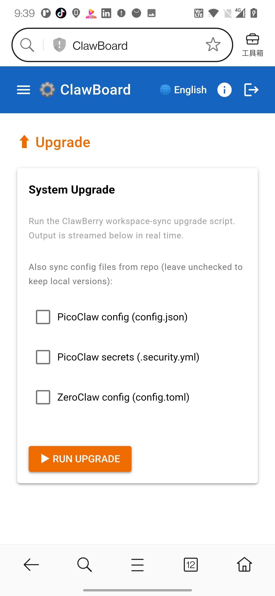

# ClawBoard

A mobile-friendly web dashboard and device-side toolkit for managing [ZeroClaw](https://github.com/zeroclaw-labs/zeroclaw) and [PicoClaw](https://github.com/zeroclaw-labs/picoclaw) on a Raspberry Pi — built with [NiceGUI](https://nicegui.io).

## Screenshots

| Dashboard | Providers | Channels |
|-----------|-----------|---------|
|  |  |  |

| Agent Settings | Security |
|---------------|---------|
|  |  |

## Features

- **10-tab layout** covering every section of `config.toml`:
  | Tab | Covers |
  |-----|--------|
  | 通用 | `api_key`, `default_provider` (dropdown), `default_model`, `default_temperature` |
  | Providers | Dynamic `[model_providers.*]` cards — add / remove any number of provider aliases |
  | 自主 | `[autonomy]` — level, risk controls, allowed commands, forbidden paths |
  | Agent | `[agent]`, `[observability]` — tool iterations, history, tracing |
  | 记忆 | `[memory]` — backend, hygiene, retention, embedding settings |
  | 通信 | `[gateway]`, `[tunnel]`, global `[channels_config]` |
  | Channels | Dynamic `[channels_config.*]` cards — add / remove from 18 channel types |
  | 安全 | `[security.resources]`, `[reliability]`, `[scheduler]` |
  | 功能 | `[web_fetch]`, `[web_search]`, `[browser]`, `[cost]` |
  | 系统 | `[transcription]`, `[heartbeat]`, `[cron]`, service log viewer |

- **Dynamic Providers tab** — each `[model_providers.<alias>]` entry gets its own card with a provider-id dropdown (37 known providers from the official reference), base_url override, `requires_openai_auth`, and per-provider `api_key`
- **Dynamic Channels tab** — supports all 18 channel types (Telegram, Discord, Slack, Mattermost, Matrix, Signal, WhatsApp, DingTalk, QQ, Lark/Feishu, Email, IRC, Webhook, Nostr, Nextcloud Talk, Linq, iMessage) with full per-channel field schemas
- **💾 Save** and **🔄 Save & Restart** buttons — writes `config.toml` and optionally restarts `zeroclaw.service` via `sudo systemctl`
- Fully mobile-friendly (Quasar/Material UI via NiceGUI)

## Requirements

```
pip install nicegui toml
```

## Usage

```bash
cd ClawBoard
python3 dashboard.py
```

Open `http://<host>:8080` in your browser (or phone).

## Config file location

The dashboard looks for `config.toml` in the same directory as `dashboard.py`, then falls back to the current working directory.

## Restart service

The **Save & Restart** button runs:

```bash
sudo systemctl restart zeroclaw.service
```

Make sure the user running the dashboard has passwordless sudo for that command, or run the dashboard as root.

## Security note

`config.toml` may contain sensitive credentials (API keys, channel secrets). The included `config.toml` uses ZeroClaw's `enc2:` encrypted key format for the global `api_key`. Do **not** commit plain-text secrets to a public repository.

---

## clawproxy — WebSocket Proxy

`clawproxy` is a standalone Go binary that ships with ClawBoard. It acts as a local WebSocket proxy between mobile/web apps and the ZeroClaw / PicoClaw agent gateways.

### Why a proxy?

On a Raspberry Pi setup, both ZeroClaw and PicoClaw may be running locally. `clawproxy` lets a single app connect to one endpoint and reach either agent — with offline queuing so messages are not lost when the app is momentarily offline.

### Architecture

```
App (mobile/web)
    │
    ▼
clawproxy :18780
    ├─ /proxy/ws          — unified WebSocket endpoint (v4, persistent sessions)
    ├─ /zc/ws             — ZeroClaw compat relay (transparent pass-through)
    └─ /pc/ws             — PicoClaw compat relay (transparent pass-through)
    │
    ├──► ZeroClaw  :42617/ws/chat
    └──► PicoClaw  :18790/ws
```

### Offline Queue (v4)

Messages sent while the upstream agent is unreachable are buffered in a local SQLite database (`/var/lib/zero/clawproxy.db`). When the connection is restored the queue is drained automatically.

| Parameter | Default | Description |
|-----------|---------|-------------|
| `--queue-db` | `~/.clawproxy/queue.db` | SQLite file path (`:memory:` = no persistence) |
| `--queue-ttl` | `3600` | Buffered message TTL in seconds |
| `--queue-depth` | `256` | Max frames buffered per session |

### Running the proxy

```bash
clawproxy \
  --proxy \
  --proxy-port 18780 \
  --zc \
  --pc \
  --queue-db /var/lib/zero/clawproxy.db \
  --queue-ttl 3600
```

Or enable the included systemd unit:

```bash
sudo cp daemon/clawberry-proxy.service /etc/systemd/system/
sudo systemctl daemon-reload
sudo systemctl enable --now clawberry-proxy
```

### Proxy Version History

| Version | Description |
|---------|-------------|
| v1 | CLI client, dual-agent, interactive terminal prompt |
| v2 | Proxy mode: app connects to clawproxy; clawproxy relays to both agents |
| v3 | Offline queue: buffer messages when app is offline, drain on reconnect |
| v4 | ✅ **Current** — Persistent SQLite store, TTL eviction, per-session delivery queue |

### Building from source

```bash
cd ClawBoard/clawproxy
go build -o clawproxy .

# Cross-compile for Raspberry Pi (ARM64)
GOOS=linux GOARCH=arm64 go build -o clawproxy-arm64 .
```

---

## Related

- [ZeroClaw](https://github.com/zeroclaw-labs/zeroclaw) — the AI agent runtime this configures
- [PicoClaw](https://github.com/zeroclaw-labs/picoclaw) — lightweight mobile-optimised agent gateway
- [NiceGUI docs](https://nicegui.io/documentation) — Python web UI framework used for this dashboard
- [ZeroClaw config reference](https://github.com/zeroclaw-labs/zeroclaw/blob/master/docs/reference/api/config-reference.md)

---

## License

Copyright © 2025-2026 ClawBoard Contributors.

This project is licensed under the **GNU General Public License v3.0 (GPL-3.0)**.

You are free to use, modify, and distribute this software under the terms of the GPL v3.0. Any derivative work must also be distributed under the same license.

See the full license text at <https://www.gnu.org/licenses/gpl-3.0.html>.
